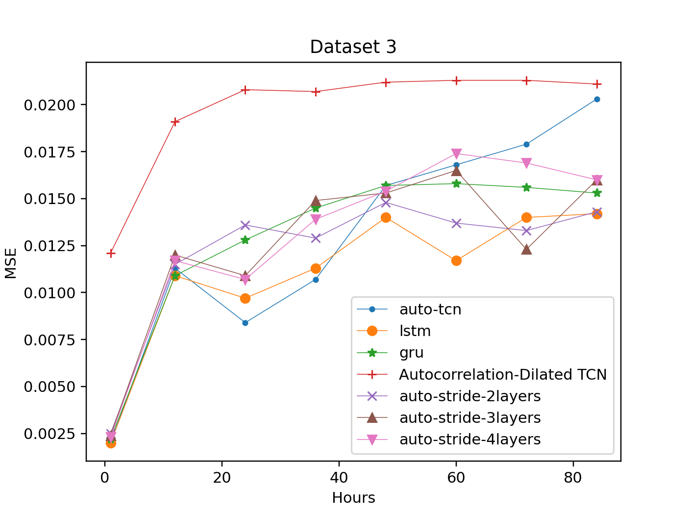
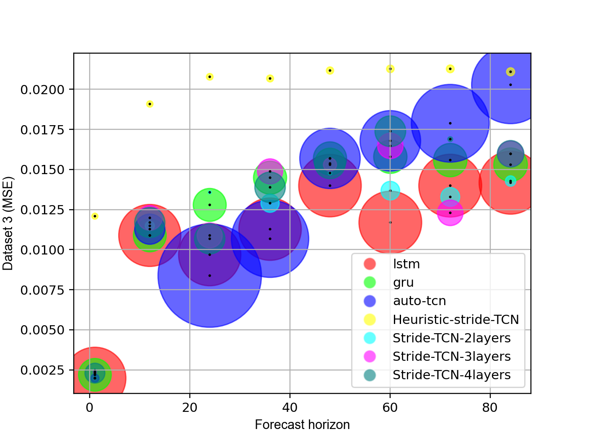

# Stride-TCN for energy consumption forecasting and its optimization
Link to Paper : [Appl. Sci. 2022](https://www.mdpi.com/2076-3417/12/19/9422)

## Requirements
[](https://pypi.org/project/keras-tcn/)

`environment.yml`: Installation the list of libraries

## Structure of repository

```
.
├── dataset
│   ├── Electricity data_CNU
│   ├── Household_power_consumption
│   └── Spain_Energy_Consumption
├── auto_correlation
│   ├── auto_cnu_stride.py
│   ├── auto_househole_stride.py
│   ├── auto_spain_stride.py
│   ├── auto_stride_searching.py
│   ├── models.py
│   ├── run_train_auto_stride.sh
│   ├── run_train_manual_stride.sh
│   ├── stride_cnu_manual.py
│   ├── stride_househole_manual.py
│   ├── stride_spain_manual.py
│   └── test.py
├── automl_searching
│   ├── exp_gru_cnu.py
│   ├── exp_gru_househole.py
│   ├── exp_gru_spain.py
│   ├── exp_lstm_cnu.py
│   ├── exp_lstm_househole.py
│   ├── exp_lstm_spain.py
│   ├── exp_searching_models_cnu.py
│   ├── exp_searching_models_househole.py
│   └── exp_searching_models_spain.py
├── cnu_power_consumption.ipynb
├── config.yaml
├── count_params_model.py
├── environment.yml
├── ett_electricity_transformer_temperature.ipynb
├── export_mse_mae.py
├── export_params.py
├── extract_stride_result.py
├── fedot_test.py
├── household_electric_power_consumption.ipynb
├── keras_auto.ipynb
├── run.sh
├── searching_models_dbs.ipynb
├── show_compare_errors.py
├── spain_energy_consumption.ipynb
├── utils.py
└── visualize.py
```

## Detailed Description

* `visualize.py`: automatically read all log files, then visualize the results(LSTM, GRU, TCN, Stride TCN)

[//]: # (![MSE on dataset 3]&#40;img/img.png&#41;)


* `export_mse_mae.py` and `export_params.py` to get the table comparison, following the bellow

```
                              1 hours   12 hours  ...  72 hours  84 hours
auto-tcn                      23681.0  1495436.0  ...  650696.0   11716.0
lstm                         372351.0   374012.0  ...  383072.0  384884.0
gru                          103747.0   104462.0  ...  108362.0  109142.0
Autocorrelation-Dilated TCN    3521.0     3884.0  ...    5864.0    6260.0
auto-stride-2layers            2081.0    30540.0  ...   34440.0    3492.0
auto-stride-3layers           58817.0    59532.0  ...   63432.0   64212.0
auto-stride-4layers           87809.0     1268.0  ...    1808.0    2316.0
```

### ./plot-comparison:

`plot_comparison.py`: plot the comparison size of models and errors

[//]: # (![MSE on dataset 3]&#40;img/img.png&#41;)


### ./auto_correlation: (our proposed model here)

`run_train_auto_stride.sh` and `run_train_manual_strie.sh` is scripts to run Stride-TCN automatically and Stride-TCN
heuristic respectively

### ./automl_searching:

- To run LSTM experiment on 3 datasets:
  `exp_lstm_househole.py` `exp_lstm_cnu.py` `exp_lstm_spain.py`

- To run GRU experiment on 3 datasets:
  `exp_gru_househole.py` `exp_searching_models_househole.py` `exp_searching_models_spain.py`

- To run TCN automatically searching HO experiment on 3 datasets:
  `exp_searching_models_cnu.py` `exp_gru_cnu.py` `exp_gru_spain.py`

## Datasets

#### This repository is using 3 datasets:

* Individual household electric power consumption is available online
* The energy consumption curves of 499 customers from Spain is available online
* The CNU energy consumption is available online


[](https://archive.ics.uci.edu/ml/datasets/individual+household+electric+power+consumption)
[](https://fordatis.fraunhofer.de/handle/fordatis/215)
[](https://github.com/andrewlee1807/tcns-with-nas/tree/main/Dataset/cnu-dataset)

## TIPS:

### Run background with specified name

```bash 
bash -c "exec -a Andrew python exp_lstm_cnu.py &"
```


